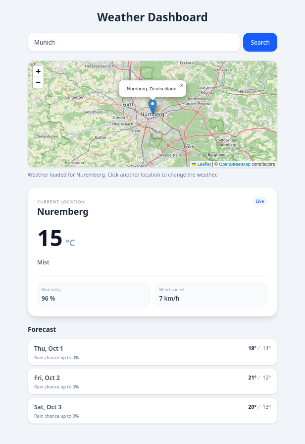

# Weather Dashboard

> **Status:** ✅ Stable

<p align="center">
  
</p>

A modern web application to monitor real-time weather conditions and view the forecast for any searched city. An interactive map lets you click a location and load the weather for its nearest city. The project combines a modular Angular frontend with a Python (FastAPI) backend.

## Features

- Search for a city by name, or click directly on the map to select a location
- Interactive map (Leaflet + OpenStreetMap tiles) with reverse geocoding to resolve the nearest city
- Current conditions: temperature, weather description, humidity, wind speed
- 3-day forecast with daily high/low and rain probability
- Backend caching and rate-limiting for the Nominatim geocoding requests, to stay within its usage policy and keep the app responsive

## Tech Stack

| Layer | Technology |
|---|---|
| Frontend | Angular, TypeScript, Leaflet |
| Backend | Python, FastAPI, Uvicorn |
| Map / Geocoding | OpenStreetMap tiles, Nominatim (search + reverse geocoding) |
| Weather data | python-weather |

## Running the Backend

Copy and run the following commands in your terminal to set up and start the FastAPI backend:

```bash
# 1. Navigate into the backend directory
cd backend

# 2. Create a local virtual environment (.venv) to isolate Python packages
python3 -m venv .venv

# 3. Activate the virtual environment
source .venv/bin/activate

# 4. Install the required dependencies (FastAPI, Uvicorn) from requirements.txt
pip install -r requirements.txt

# 5. Start the development server with auto-reload enabled
uvicorn app.main:app --reload
```

## Running the Frontend

```bash
# 1. Install Angular CLI globally (if not already installed)
npm install -g @angular/cli@22

# 2. Navigate to the frontend directory
cd frontend

# 3. Install project dependencies
npm install

# 4. Start the frontend locally
ng serve
```

## Author

Fabian Honta-Jekel · [GitHub](https://github.com/Tscheggel)